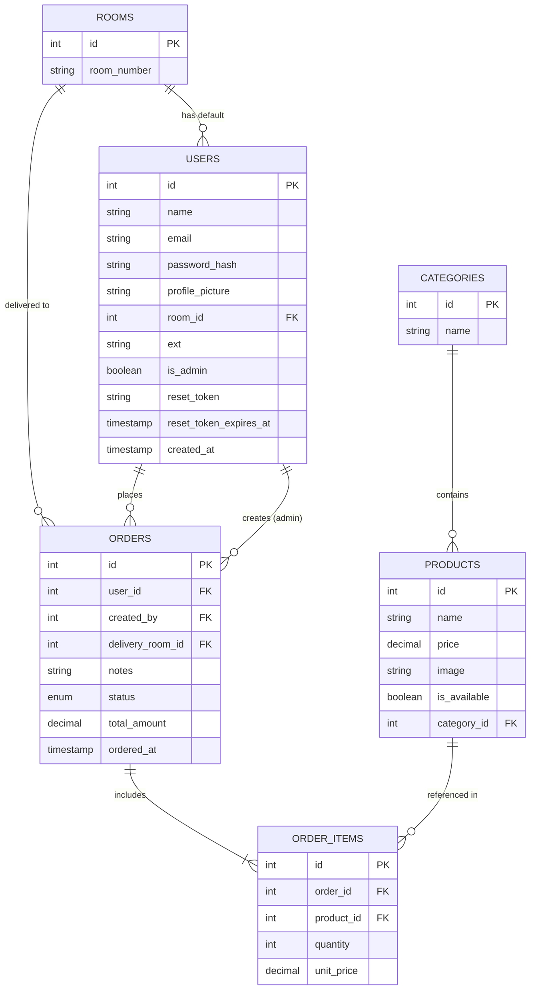

# Pava-Coffee

## Current Database ERD

```mermaid
erDiagram
  USERS {
    int id PK
    string name
    string email
    string password_hash
    string profile_picture
    int room_id FK
    string ext
    boolean is_admin
    string reset_token
    timestamp reset_token_expires_at
    timestamp created_at
  }
  ROOMS {
    int id PK
    string room_number
  }
  CATEGORIES {
    int id PK
    string name
  }
  PRODUCTS {
    int id PK
    string name
    decimal price
    string image
    boolean is_available
    int category_id FK
  }
  ORDERS {
    int id PK
    int user_id FK
    int created_by FK
    int delivery_room_id FK
    string notes
    enum status
    decimal total_amount
    timestamp ordered_at
  }
  ORDER_ITEMS {
    int id PK
    int order_id FK
    int product_id FK
    int quantity
    decimal unit_price
  }

  ROOMS ||--o{ USERS : "has default"
  ROOMS ||--o{ ORDERS : "delivered to"
  USERS ||--o{ ORDERS : "places"
  USERS ||--o{ ORDERS : "creates (admin)"
  CATEGORIES ||--o{ PRODUCTS : "contains"
  ORDERS ||--|{ ORDER_ITEMS : "includes"
  PRODUCTS ||--o{ ORDER_ITEMS : "referenced in"
```
