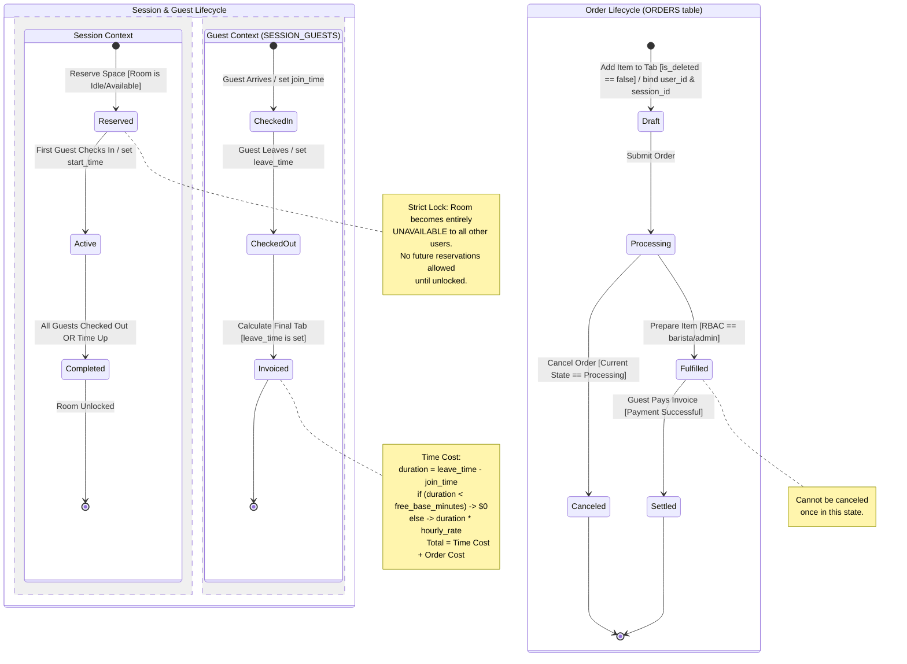
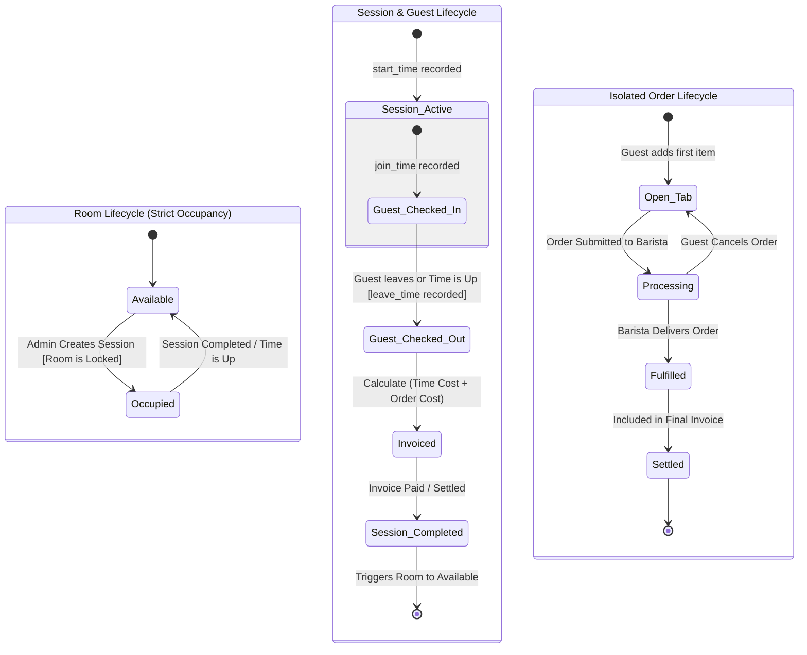

# Lifecycle Diagrams

```mermaid
stateDiagram-v2
    direction TB

    %% Session and Guest Lifecycle
    state "Session & Guest Lifecycle" as SessionGuest {
        direction TB

        state "Session Context" as SessionContext {
            [*] --> Reserved : Reserve Space [Room is Idle/Available]

            note right of Reserved
                Strict Lock: Room becomes entirely
                UNAVAILABLE to all other users.
                No future reservations allowed
                until unlocked.
            end note

            Reserved --> Active : First Guest Checks In / set start_time
            Active --> Completed : All Guests Checked Out OR Time Up
            Completed --> [*] : Room Unlocked
        }

        --

        state "Guest Context (SESSION_GUESTS)" as GuestContext {
            [*] --> CheckedIn : Guest Arrives / set join_time
            CheckedIn --> CheckedOut : Guest Leaves / set leave_time
            CheckedOut --> Invoiced : Calculate Final Tab [leave_time is set]

            note right of Invoiced
                Time Cost:
                duration = leave_time - join_time
                if (duration < free_base_minutes) -> $0
                else -> duration * hourly_rate

                Total = Time Cost + Order Cost
            end note

            Invoiced --> [*]
        }
    }

    %% Isolated Order Lifecycle
    state "Order Lifecycle (ORDERS table)" as OrderLifecycle {
        direction LR

        [*] --> Draft : Add Item to Tab [is_deleted == false] / bind user_id & session_id

        Draft --> Processing : Submit Order

        Processing --> Canceled : Cancel Order [Current State == Processing]
        Canceled --> [*]

        Processing --> Fulfilled : Prepare Item [RBAC == barista/admin]

        %% Guard visualization for Fulfilled -> Cancel
        note right of Fulfilled
            Cannot be canceled
            once in this state.
        end note

        Fulfilled --> Settled : Guest Pays Invoice [Payment Successful]
        Settled --> [*]
    }
```

```mermaid
stateDiagram-v2
    %% ROOM LIFECYCLE (The Physical Space)
    state "Room Lifecycle (Strict Occupancy)" as RoomState {
        [*] --> Available
        Available --> Occupied : Admin Creates Session [Room is Locked]
        Occupied --> Available : Session Completed / Time is Up
    }

    %% SESSION & GUEST LIFECYCLE (The Temporal Event)
    state "Session & Guest Lifecycle" as SessionState {
        [*] --> Session_Active : start_time recorded

        state Session_Active {
            [*] --> Guest_Checked_In : join_time recorded
            Guest_Checked_In --> Guest_Checked_Out : Guest leaves or Time is Up [leave_time recorded]
        }

        Guest_Checked_Out --> Invoiced : Calculate (Time Cost + Order Cost)
        Invoiced --> Session_Completed : Invoice Paid / Settled
        Session_Completed --> [*] : Triggers Room to Available
    }

    %% ORDER LIFECYCLE (The Isolated Tab)
    state "Isolated Order Lifecycle" as OrderState {
        [*] --> Open_Tab : Guest adds first item
        Open_Tab --> Processing : Order Submitted to Barista

        Processing --> Open_Tab : Guest Cancels Order
        Processing --> Fulfilled : Barista Delivers Order

        Fulfilled --> Settled : Included in Final Invoice
        Settled --> [*]
    }
```
